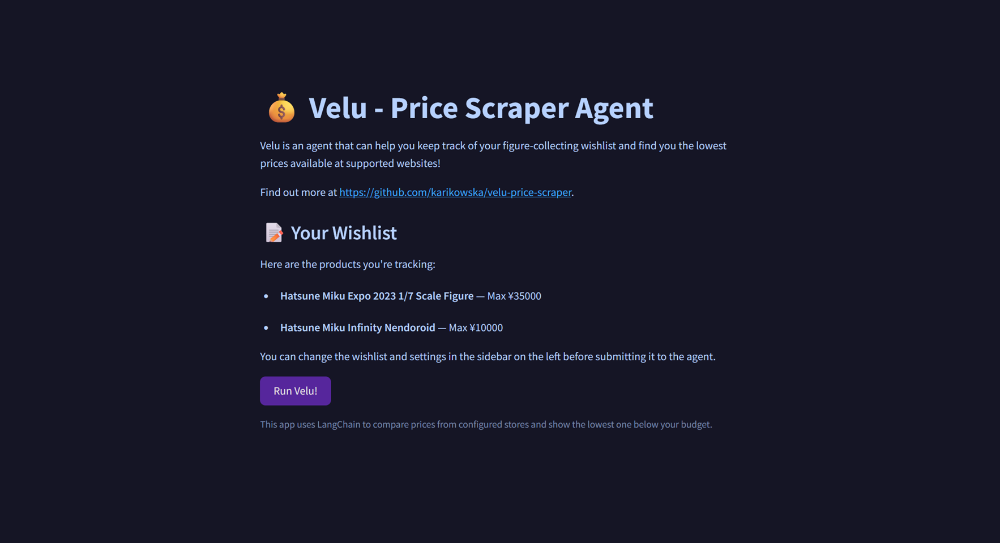

# 🛍️ Velu - AI-Powered Price Scraper
<p align="center">
  
</p>

<p align="center">
  
</p>

An agentic/LLM-powered price-checking tool that scrapes figure listings from websites like **Solaris Japan**, extracts prices using **LangChain + OpenAI**, and intelligently fills in the price and picks the best matches. 

I collect figures in my free time and love getting a good deal - but this can be time-consuming on the regular! I made this tool to speed the process up :)

---

## ✨ Features

- 🔍 Scrapes real-time product listings from supported sites
- 2️⃣ Offers two modes:
    - 🎇 LLM Mode: an LLM with NLP that will extract and interpret price information from messy HTML!
    - 🗪 Agent Mode: an Agent that will find the lowest price below your budget by parsing your wishlist!
- 🗂️ LLM Mode supports single-product CLI mode and batch YAML input
- 📓 Agent Mode features a user-friendly UI
- ⚙️ Modular and very easy to extend to other figure stores!

---
## 🧪 Example Command & Output for LLM Mode
Command:
```
$ python main.py "Hatsune Miku Rascal Trio-Try-It" sol
```

Sample output:
```
🔎 Scraping: Araiguma Rascal - Vocaloid - Hatsune Miku - Rascal - Trio-Try-iT - Akuma (FuRyu)
https://solarisjapan.com//products/araiguma-rascal-vocaloid-hatsune-miku-rascal-trio-try-it-akuma-furyu?oid=268825&qid=9546401fd66c683846ba8262b7713d55
💷 Price: ¥17,120 | Raw: This is a figure listing.

The price of the Araiguma Rascal - Vocaloid - Hatsune Miku - Rascal - Trio-Try-iT - Akuma figure is ¥17,120 JPY. After converting from JPY to GBP, the final price is £120.
```

---
## 🧪 Preview of UI for Agentic Mode

<p align="center">
  
</p>

## 🚀 Getting Started

### 1. Install dependencies
To install dependencies in this project, use the following command:
```
pip install -r requirements.txt
```

You'll also need an OpenAI API key. Set it in your terminal using ```export``` as such:
```
export OPENAI_API_KEY=...
```

### 2. Usage for LLM Mode
#### Single item
To run the single item price scraper, you will need the following command:
```
$ python main.py "<nameofitem>" <nameofsupportedservice>
```

#### Bulk
To run the price scraper in bulk, you will need to create a YAML file that looks like this:
```
- name: Hatsune Miku Pop Up Parade Galaxy Live
  stores:
    - anim
    - nng

- name: Hatsune Miku Virtual Popstar Ver.
  stores:
    - nng
    - sol
    - jf
```

And then run the following command to invoke it:
```
$ python main.py "path/to/config.yaml"
```

If you type in too many stores + queries in a row in one YAML, you may run into an issue with token length. As the input and output of the LLM (for now at least) is not being closely prompt-engineered to perfection, it might take a few retries to get it your request under token i/o limit.

### 3. Usage for Agent Mode

To start up the app, be in the project root and run:
```
$ streamlit run app.py
```
This command will launch the app locally within your browser.

#### Wishlist
The agent price-scrapes based on your wishlist, which is within ```config/wishlist.yaml```.

Here is an example wishlist:
```
config:
  allowed_sites:
  - search_amiami
  - search_solaris
  - search_ninningame
  - search_animota
  - search_gsce
  - search_japanfigure
  currency: JPY
products:
- max_price: 35000
  name: Hatsune Miku Expo 2023 1/7 Scale Figure
  sites:
  - search_solaris
  - search_japanfigure
  - search_ninningame
- max_price: 10000
  name: Hatsune Miku Infinity Nendoroid
  sites:
  - search_ninningame
  - search_animota
  - search_solaris
```
You are able to edit the wishlist through the YAML and within the web app as well, by clicking on the left sidebar and ticking 'Edit Wishlist'.

When your wishlist is ready, ensure you have saved your changes, then click 'Run Velu!' and wait for a few minutes to get your scraped results :)

### 4. Supported Stores
Currently, the supported services for both modes are:
- Solaris Japan == ```sol```
- Nin-Nin Game == ```nng```
- Animota == ```anim```
- Japan Figure == ```jf```
- Good Smile Europe == ```gsce```

I've coded up a complete scraper for AmiAmi, but they sadly use Cloudflare and I seem to be getting obfuscated results. I need to work on it a bit more.

---

## 🎓 Lessons learned!

This project has:

🐍 Reinforced my Python skills

🌐 Taught me web scraping with BeautifulSoup4, and how to create simple UI with Streamlit

🧠 Introduced me to LangChain, agentic tooling and capabilities, effective prompting, and handling token limitations

🔤 Refreshed my NLP skills, including usage of SentenceTransformers and vector embeddings

🔍 Shown me how to navigate Inspect Element and browser dev tools

🧱 Shown me how to build and modularize a mini-app effectively

---

## 📝 Future TODOs on this project:

- [x] finish README instructions to run
- [x] make batch YAML input method work
- [x] add Playwright to preload bits of websites
- [x] expand functionality to more websites than just Solaris Japan
- [x] add other stores like Animota, Japan Figure Store... (if they are scrapable!)
- [x] use embeddings to score whether the titles of the products are relevant to the query
- [x] add a wishlist feature (YAML) - user has a wishlist which they can run the scraper on regularly to monitor for current best prices in the file
- [x] add agentic mode for more autonomous scraping
- [x] add preferred budget per figure (YAML) - results will not be shown unless they are less than the budget!
- [x] add Streamlit integration to talk to the LLM directly?
- [x] add web UI or a dashboard to show results
- [ ] make demo gif of both capabilities
- [ ] add currency conversion that works
- [ ] add reseller sites like Depop, Vinted or Ebay
- [ ] add JP stores like Mercari.jp and Buyee with translation
- [ ] add NLP to replace where an LLM doesn't need to be to optimise i/o tokens for LLM Mode
- [ ] add a scheduler for automatic runs for Agent Mode
- [ ] look into why AmiAmi can't have its prices scraped and if we can go around that
- [ ] add unit tests
- [ ] add database integration to save results?
- [ ] add license to repo

---

## DISCLAIMER

I do not own any of the stores mentioned above. I do not own Hatsune Miku either, she is property of Crypton Future Media. All I own here is the code for the price scraper.
